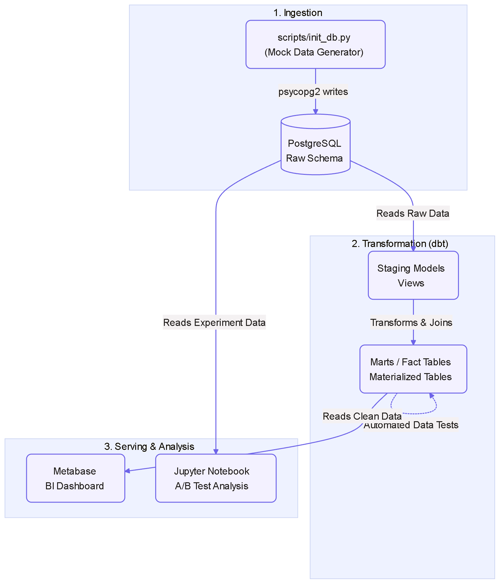
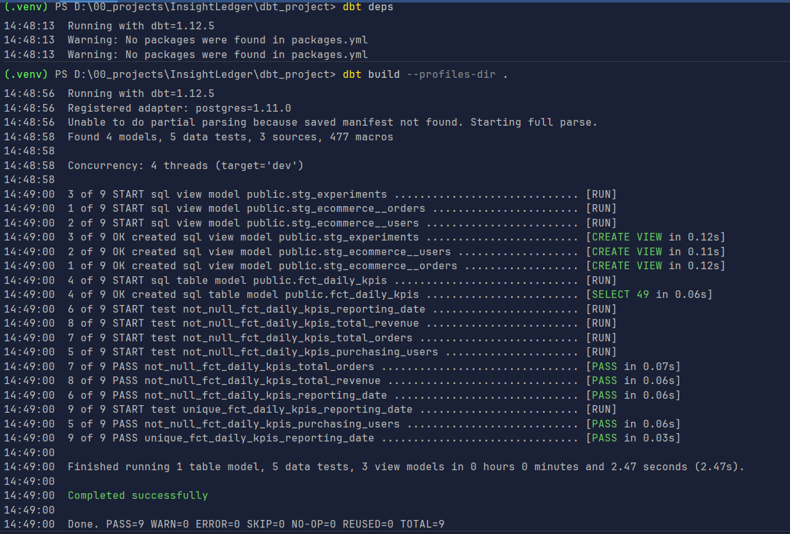
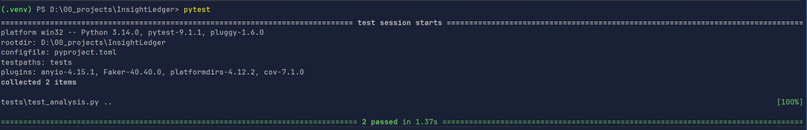
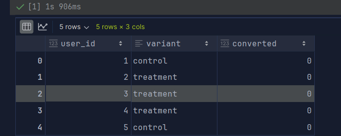
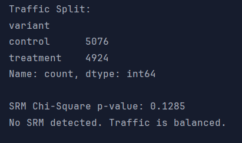
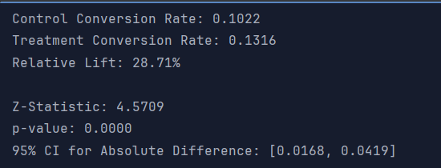
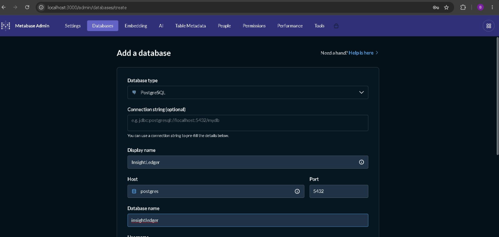
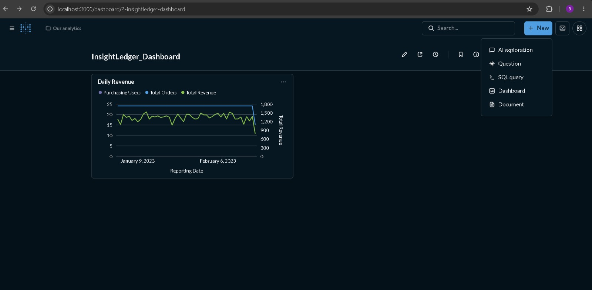

# Release v0.1.0: Initial End-to-End Analytics Stack

**Date:** 2026/10/03  
**Version:** `v0.1.0`

## Executive Summary

This is the inaugural release of **InsightLedger**, a fully functional, containerized, local data stack designed to
solve standard analytical pain points. It successfully demonstrates the ingestion of raw mock data, governed metric
transformations, strict automated data-quality testing, rigorous statistical experiment analysis, and a self-serve BI
layer.

## Key Highlights & Proof of Execution

### 1. System Architecture

InsightLedger operates on a modern, OSS-driven pipeline using PostgreSQL, dbt, Jupyter (Python), and Metabase.

### 2. Transformation & Data Quality Validation

Data transformations were executed using `dbt-postgres`. The pipeline successfully materialized views and tables,
passing all 5 strict data-quality tests (null checks and uniqueness constraints) preventing bad data from reaching the
dashboard.

Application-level integration dependencies were verified using `pytest`:

### 3. Rigorous A/B Test Analysis

Experiment data was analyzed mathematically to prevent false positives and evaluate genuine business impact.

- **Data Load:** Extracted raw experimental assignments.
  
- **Validity Check:** Verified the 50/50 split via a Chi-Square test, confirming no Sample Ratio Mismatch (SRM).
  
- **Statistical Significance:** Executed a 2-proportion Z-test proving a statistically significant 28.71% relative lift,
  accompanied by 95% Confidence Intervals.
  

### 4. Self-Serve Business Intelligence (Metabase)

*Note: The following visuals demonstrate the connection and visualization of the modeled data (`fct_daily_kpis`) in our
BI layer.*

- **Database Connection & Schema Discovery:**
  
- **KPI Dashboard Preview:** (Visualizing Total Revenue and Purchasing Users)
  

## Changelog

This project utilizes automated versioning and changelog generation. For a complete list of features, fixes, and
conventional commits associated with this release, please refer to the
**[CHANGELOG.md](https://github.com/Bibek-Dhakal/InsightLedger/blob/main/CHANGELOG.md)** at the root of the
repository, or view the official GitHub Release page.

## Contributor List

- Bibek Dhakal
